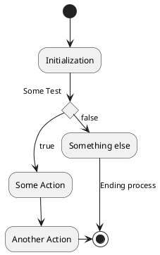

# Do Things This Way

| Author / Modifier           | Status        | Deciders                                     | Date                      |
| :-------------------------- | :---------    | :---------                                   | :-----------              |
|Someone| proposed | list everyone involved in the decision | 2020-12-24 |



## 👀 Context and Problem Statement

<div style="display: flex"><div style="flex: 50%">

**In order to** uphold a professional standard regarding the ease of creation and modification of features in the existing systems,

**As** software developers,

**We want to** do something.

> **How/What stuff should we do?**

</div><div style="flex: 50%">

Measurement of some metrics about current situation:

A few key things we identified:
* Some pain point

</div></div>

## 🚦 Decision Drivers

<div style="display: flex"><div style="flex: 50%">

* (put words on the main "relevance" aspects of a solution)
* Initial Cost
* Maintenance Cost

</div><div style="flex: 50%">

* Constraints generated on future decisions
* Consistently-up-to-date-documentation Cost
* Integration cost with current tooling

</div></div>

## 💡 Considered Options

* Option 1: Do something
* Option 2: Do something else

## 🎯 Decision Outcome
* **Option 1 : description**
* Because justification.

## 🎭 Pros and Cons of the Options

<div style="display: flex"><div style="flex: 50%">

### Option 1: Do something

* ✅ pro regarding first decision driver
* 🚫 cons regarding first or second decision driver
* 🤷 unknown regarding first or second decision driver

</div><div style="flex: 50%">

```
Example
```

</div></div>

<div style="display: flex"><div style="flex: 50%">

### Option 2: Do something else

* ✅ pro regarding first decision driver
* 🚫 cons regarding first or second decision driver
* 🤷 unknown regarding first or second decision driver

</div><div style="flex: 50%">

```
Example
```

</div></div>

## More

* [Some link](some_url)


